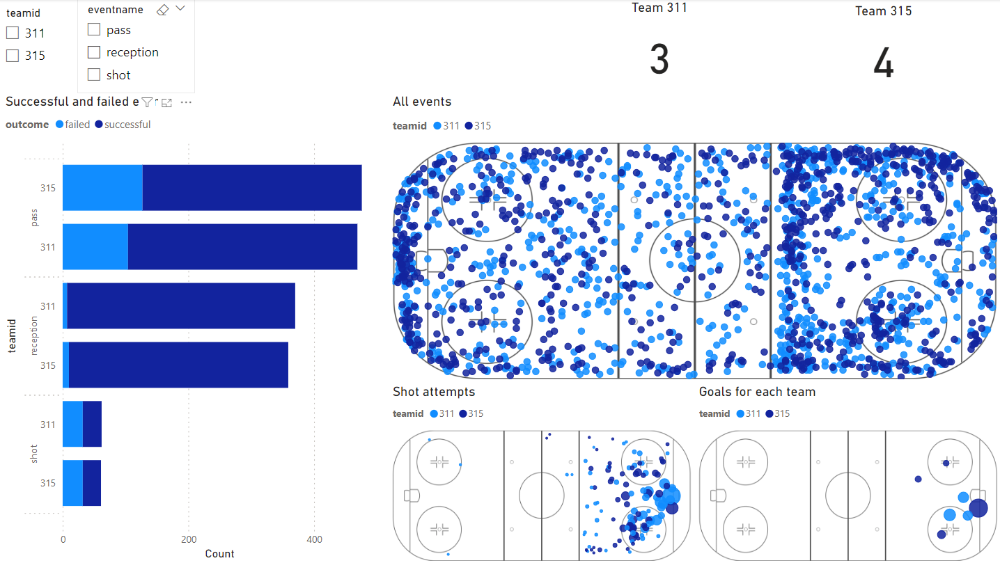

# Sportlogiq Data Analyst Questionnaire

Welcome to my submission for the Sportlogiq Data Analyst Questionnaire. This project demonstrates my problem-solving skills, hockey knowledge, attention to detail, and proficiency in data analysis using Python. The analysis is based on two datasets from a randomly chosen hockey game and involves various tasks including data merging, statistical analysis, and visualizations.

## Project Overview

### Libraries Used
- **Numpy**: For numerical operations
- **Pandas**: For data manipulation and analysis
- **Matplotlib/Plotly**: For data visualization
- **Sklearn**: For statistical analysis

### Data Description
- **Event Data**: Contains a condensed set of events from a hockey game.
- **Expected Goals (xG) Data**: Contains Expected Goals values to be merged onto shot attempts.
- **Rink Template**: Used for scatter plots to display events on the hockey rink.

### Key Points
- **Coordinates**: X and Y coordinates are in feet, adjusted for both teams attacking from left (defensive zone) to right (offensive zone).
- **Binary Columns**: Indicate binary outcomes (0 = No, 1 = Yes).
- **Time Columns**: Compiled game time is in seconds; periods are 20 minutes long, with overtime being 5 minutes or less.

### Tasks Performed
1. **Data Merging**: Merged xG values with shot attempts, ensuring non-corresponding xG values were excluded.
2. **Statistical Analysis**: Analyzed various metrics including successful passes and shots.
3. **Visualizations**: Created scatter plots using the provided rink template to display events on the hockey rink.
4. **Problem Solving**: Addressed specific questions related to the data, demonstrating my analytical approach and decision-making process.
5. **Power BI Dashboard**: Created an additional Power BI file to provide interactive visualizations and insights from the data.

## Repository Contents
- **notebooks/**: Jupyter notebooks containing the analysis and visualizations.
- **data/**: Contains the event data, xG data, and rink template.
- **images/**: Visualizations generated during the analysis.
- **powerbi/**: Contains the Power BI file with interactive dashboards.

## How to Use
1. Clone the repository: [git clone https://github.com/yourusername/sportlogiq-questionnaire.git](https://github.com/rvarjao/Hockey-Game-Data-Analysis.git)
2. Open and run the Jupyter notebooks in the `notebooks` directory to see the analysis.
3. Open the Power BI file in the `powerbi` directory to explore the interactive dashboards.

## Conclusion
This project showcases my ability to work with sports data, perform detailed analysis, and create meaningful visualizations using both Python and Power BI. I hope you find my work insightful and comprehensive.
